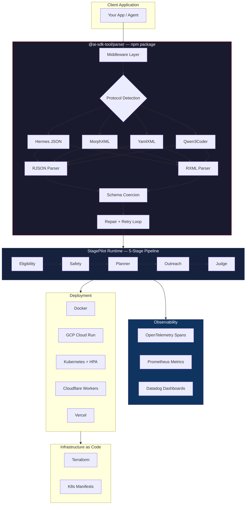
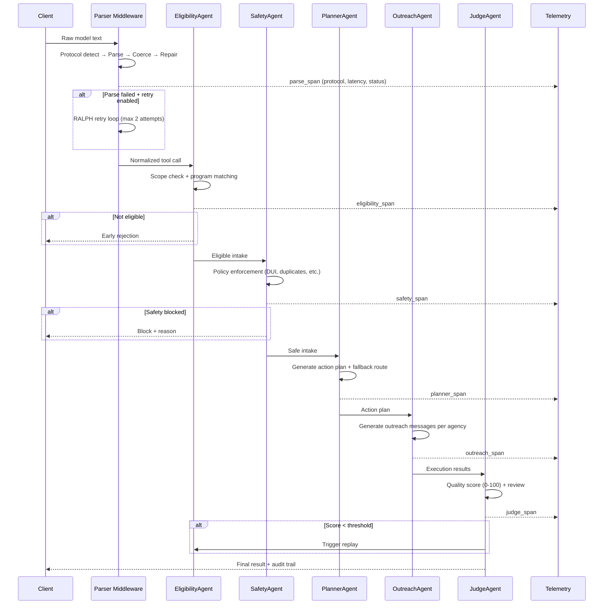

# StagePilot

[](https://www.npmjs.com/package/@ai-sdk-tool/parser)
[](https://www.npmjs.com/package/@ai-sdk-tool/parser)
[](https://github.com/KIM3310/stage-pilot/actions)
[](https://codecov.io/gh/KIM3310/stage-pilot)
[](https://opensource.org/licenses/Apache-2.0)
[](https://www.typescriptlang.org/)

**Tool-calling reliability runtime for LLMs.** Parses, repairs, and retries malformed tool-call output so you don't have to. Lifts baseline success from **25% to 90%** on a 60-case benchmark with 30 mutation modes.

## The Problem

Models without native tool support produce unreliable output — XML one turn, JSON the next, hallucinated tool names, missing args, type mismatches. On our benchmark, **baseline success is 25%**. Most workarounds are regex hacks or single-pass prompts. They break when the format drifts and give you no way to see what went wrong.

## The Solution

StagePilot provides three composable pieces:

| Layer | What it does | Use independently? |
|---|---|---|
| **`@ai-sdk-tool/parser`** | AI SDK middleware — format normalization, schema coercion, repair | ✅ `pnpm add @ai-sdk-tool/parser` |
| **StagePilot Runtime** | 5-stage multi-agent pipeline with pass/fail gates and telemetry | ✅ Full API server |
| **BenchLab** | BFCL experiment tooling for prompt-mode tool calling | ✅ Standalone experiments |

## Architecture



### Stage-Gated Pipeline Detail



## Benchmark Results

Source: [`docs/benchmarks/stagepilot-latest.json`](docs/benchmarks/stagepilot-latest.json) — 60 cases, 30 mutation modes.

| Strategy | Success | Rate | Avg Latency | P95 Latency | Avg Attempts |
|---|---:|---:|---:|---:|---:|
| `baseline` | 10 / 40 | 25.00% | 0.02 ms | 0.05 ms | 1.00 |
| `middleware` | 26 / 40 | 65.00% | 0.13 ms | 0.39 ms | 1.00 |
| **`middleware+ralph-loop`** | **36 / 40** | **90.00%** | 0.06 ms | 0.10 ms | 1.35 |

### 30 Mutation Modes

Each mode simulates a real-world LLM output failure pattern:

| # | Mode | What it tests |
|---|---|---|
| 1 | `strict` | Well-formed JSON baseline |
| 2 | `relaxed-json` | Unquoted keys, single quotes |
| 3 | `coercible-types` | String ↔ number type mismatches |
| 4 | `missing-brace` | Truncated JSON (missing closing brace) |
| 5 | `garbage-tail` | Extra tokens after valid JSON |
| 6 | `no-tags` | JSON without `<tool_call>` wrapper |
| 7 | `prefixed-valid` | Prose text before/after tool call |
| 8 | `deeply-nested-args` | 6 levels of nesting |
| 9 | `unicode-in-values` | Non-ASCII / emoji in values |
| 10 | `oversized-payload` | 12KB+ payload exceeding limits |
| 11 | `trailing-comma-json` | Trailing commas in JSON |
| 12 | `json-in-xml-wrapper` | Double-wrapped format |
| 13 | `concurrent-tool-calls` | Multiple tool calls in one response |
| 14 | `empty-arguments` | Correct name, empty args ⚠️ |
| 15 | `backreference-placeholder` | Template variables `{{...}}` |
| 16 | `adversarial-injection` | Prompt injection in values |
| 17 | `wrong-tool-name` | Hallucinated tool name ⚠️ |
| 18 | `truncated-json` | Network cutoff mid-value |
| 19 | `html-escaped-payload` | HTML entity encoding |
| 20 | `double-encoded-json` | `JSON.stringify()` applied twice |
| 21 | `markdown-fenced` | Tool call in ` ```json ``` ` code block |
| 22 | `yaml-body` | YAML body instead of JSON |
| 23 | `mixed-quotes` | Mixed single/double quotes |
| 24 | `comment-in-json` | JSON with `//` comments |
| 25 | `bom-prefix` | UTF-8 BOM before content |
| 26 | `null-bytes` | Null bytes in strings |
| 27 | `reversed-key-order` | `arguments` before `name` in JSON |
| 28 | `multiline-values` | Embedded newlines in values |
| 29 | `partial-schema` | Some required fields missing ⚠️ |
| 30 | `xml-attribute-style` | Tool call as XML attributes |

⚠️ = Unrecoverable by retry (requires model-level fix → see [tool-call-finetune-lab](https://github.com/KIM3310/tool-call-finetune-lab))

## Quick Start

### As npm middleware (drop-in, 3 lines)

```bash
pnpm add @ai-sdk-tool/parser
```

```ts
import { morphXmlToolMiddleware } from "@ai-sdk-tool/parser";
import { wrapLanguageModel, streamText } from "ai";

// Works with any AI SDK provider: OpenAI, Anthropic, Google, Ollama, etc.
const enhanced = wrapLanguageModel({
  model: anyModel,
  middleware: morphXmlToolMiddleware,
});

const result = await streamText({
  model: enhanced,
  prompt: "What is the weather in Seoul?",
  tools: {
    get_weather: {
      description: "Get weather for a city",
      parameters: z.object({ city: z.string() }),
      execute: async ({ city }) => `${city}: 22°C, sunny`,
    },
  },
});
```

### As full runtime (API server)

```bash
git clone https://github.com/KIM3310/stage-pilot.git
cd stage-pilot
pnpm install
pnpm api:stagepilot
# → http://127.0.0.1:8080/demo
```

### Middleware Variants

| Middleware | Best for | Example models |
|---|---|---|
| `hermesToolMiddleware` | JSON-style tool payloads | Hermes, Llama |
| `morphXmlToolMiddleware` | XML + schema-aware coercion | Claude, GPT |
| `yamlXmlToolMiddleware` | XML tags + YAML bodies | Mixtral |
| `qwen3CoderToolMiddleware` | `<tool_call>` markup | Qwen, UI-TARS |

## API Endpoints

```bash
pnpm api:stagepilot  # http://127.0.0.1:8080
```

| Endpoint | Method | What it does |
|---|---|---|
| `/v1/plan` | POST | Run a case through the 5-stage pipeline |
| `/v1/benchmark` | POST | Run the full benchmark suite |
| `/v1/insights` | POST | Narrative insights from benchmark data |
| `/v1/whatif` | POST | What-if simulation for staffing/demand |
| `/v1/metrics` | GET | Prometheus metrics (scrape-ready) |
| `/health` | GET | Health check (K8s probes) |
| `/demo` | GET | Interactive demo UI |

## Deployment

<details>
<summary><strong>Docker</strong></summary>

```bash
docker build -t stagepilot-api .
docker run -p 8080:8080 -e GEMINI_API_KEY="$GEMINI_API_KEY" stagepilot-api
```
</details>

<details>
<summary><strong>GCP Cloud Run</strong> (one command)</summary>

```bash
pnpm deploy:stagepilot
```

Infrastructure managed by Terraform:
```bash
cd infra/terraform
terraform init && terraform apply
```
</details>

<details>
<summary><strong>Kubernetes</strong> (production)</summary>

```bash
kubectl create namespace stagepilot
kubectl create secret generic stagepilot-secrets \
  --namespace stagepilot \
  --from-literal=gemini-api-key="$GEMINI_API_KEY"
kubectl apply -f infra/k8s/

# Includes: Deployment (2 replicas), Service, HPA (2-10 pods),
# ConfigMap, liveness/readiness/startup probes
```
</details>

<details>
<summary><strong>Vercel / Cloudflare Workers</strong></summary>

See `vercel.json` and `wrangler.toml` in the repo root.
</details>

## Observability Stack

```
┌─────────────────────────────────────────────────────┐
│                  StagePilot API                      │
│                                                     │
│  ┌──────────┐  ┌──────────┐  ┌──────────────────┐  │
│  │ OTel SDK │  │Prometheus│  │  Datadog Agent   │  │
│  │  Spans   │  │ Counters │  │  (optional)      │  │
│  └────┬─────┘  └────┬─────┘  └────────┬─────────┘  │
│       │              │                 │            │
└───────┼──────────────┼─────────────────┼────────────┘
        │              │                 │
   ┌────▼────┐   ┌─────▼─────┐   ┌──────▼──────┐
   │  Jaeger  │   │ Grafana   │   │  Datadog    │
   │  Zipkin  │   │ Dashboard │   │  Dashboard  │
   └──────────┘   └───────────┘   └─────────────┘
```

- **OpenTelemetry**: Per-stage spans (`eligibility_span`, `safety_span`, `planner_span`, `outreach_span`, `judge_span`, `parse_span`)
- **Prometheus**: `toolCallsTotal` counter + `toolCallParseDuration` histogram, scraped via `/v1/metrics`
- **Datadog**: Pre-built dashboard + monitor configs in `docs/datadog/`

## Project Layout

```
src/
  adapters/          # AWS S3/CloudWatch, GCP integrations
  api/               # HTTP server, Prometheus metrics, sessions
  bin/               # CLI entry points (stagepilot-api, benchlab-api)
  community/         # Community protocols (Sijawara, UI-TARS)
  core/              # Parser protocols (8 variants), prompts, utils
  rjson/             # Relaxed JSON parser with repair heuristics
  rxml/              # Relaxed XML parser with tokenizer + schema extraction
  schema-coerce/     # Type coercion engine
  stagepilot/        # 5-agent orchestrator, benchmark, insights, twin
  telemetry/         # OpenTelemetry + Prometheus instrumentation
  __tests__/         # ~174 unit test files
tests/               # ~13 integration test files
infra/
  k8s/               # Deployment, Service, HPA, ConfigMap
  terraform/         # GCP Cloud Run provisioning
docs/
  adr/               # Architecture Decision Records
  benchmarks/        # Benchmark artifacts + reports
  benchlab/          # BFCL experiment docs
  datadog/           # Dashboard + monitor configs
experiments/         # 5 BFCL experiment variants (Claude, Gemini, Grok, Kiro, OpenAI-compat)
scripts/             # Build, deploy, load-test (k6)
.github/workflows/   # CI/CD pipelines
```

## Architecture Decision Records

| ADR | Title | Summary |
|---|---|---|
| [ADR-001](docs/adr/001-stage-gated-pipeline.md) | Stage-Gated Pipeline | Why 5 sequential agents instead of single-pass. Each stage isolates a concern, emits OTel spans, enables independent model selection. |
| [ADR-002](docs/adr/002-parser-middleware-design.md) | Parser as AI SDK Middleware | Why middleware pattern over custom wrapper or post-processing. Provider-agnostic, composable, own npm lifecycle. |
| [ADR-003](docs/adr/003-benchmark-methodology.md) | Benchmark Methodology | Why deterministic seeded cases with 30 mutation modes. Reproducible, captures real-world failure patterns, separates format issues from model understanding gaps. |

## For Different Roles

<details>
<summary><strong>🤖 For AI Engineers</strong></summary>

**What you'll learn from this project:**
- How to build a robust parser that handles 30 types of malformed LLM output
- Stage-gated pipeline design for multi-agent systems
- Bounded retry strategy (RALPH loop) — why 2 attempts is the sweet spot
- Schema coercion patterns for type normalization
- How to evaluate tool-calling reliability with reproducible benchmarks

**Key files:**
- `src/core/protocols/` — 8 parser protocol implementations
- `src/rxml/` + `src/rjson/` — Relaxed parsers with repair heuristics
- `src/stagepilot/agents.ts` — 5-agent implementations
- `src/stagepilot/benchmark.ts` — 30 mutation modes

**Related:** [tool-call-finetune-lab](https://github.com/KIM3310/tool-call-finetune-lab) — LoRA fine-tuning approach for the remaining 10% gap (Qwen2.5-7B, 65%→80% accuracy on BFCL)
</details>

<details>
<summary><strong>📊 For Data Engineers</strong></summary>

**What you'll learn from this project:**
- Deterministic benchmark pipeline with seeded random generation
- 30 mutation modes as a data quality testing framework
- Structured artifact capture for reproducible evaluation
- Prometheus metrics pipeline for runtime data collection
- How to design evaluation harnesses that separate signal from noise

**Key files:**
- `src/stagepilot/benchmark.ts` — Benchmark harness with 30 mutation modes
- `docs/benchmarks/` — Structured JSON artifacts + reports
- `src/telemetry/metrics.ts` — Prometheus counter/histogram definitions
- `experiments/` — 5 BFCL experiment variants with reproducible artifacts

**Data stack touchpoints:** Benchmark results export to JSON → analysis in any data tool. Load test data via k6. Runtime metrics via Prometheus/Grafana.
</details>

<details>
<summary><strong>🏗️ For Solutions Architects</strong></summary>

**What you'll learn from this project:**
- How to design a modular AI system where each layer (parser, orchestration, observability) is independently adoptable
- Infrastructure-as-Code patterns: K8s manifests with HPA + Terraform for Cloud Run
- Multi-cloud deployment: GCP Cloud Run, Kubernetes, Vercel, Cloudflare Workers
- Observability architecture: OpenTelemetry → Jaeger/Datadog, Prometheus → Grafana
- Architecture Decision Records as a communication tool

**Key files:**
- `docs/adr/` — 3 ADRs documenting key design decisions
- `infra/k8s/` — Production K8s manifests (deployment, HPA, probes)
- `infra/terraform/` — GCP Cloud Run with Secret Manager integration
- `docs/solution-architecture.md` — System overview
- `docs/datadog/` — Pre-built dashboards and monitors

**Integration boundary:** Parser middleware is a standalone npm package. The full runtime adds orchestration, benchmarks, and observability. Adopters can choose either or both.
</details>

## Tech Stack

| Category | Technologies |
|---|---|
| **Language** | TypeScript 5.9, Node.js 20 |
| **AI SDK** | Vercel AI SDK 6.0, Zod 4.3 |
| **Parsing** | Custom RJSON + RXML engines, 8 protocol variants |
| **Observability** | OpenTelemetry (spans), Prometheus (metrics), Datadog (dashboards) |
| **Infrastructure** | Docker, Kubernetes (HPA), Terraform, GCP Cloud Run |
| **Deployment** | GCP Cloud Run, Vercel, Cloudflare Workers |
| **Cloud** | AWS (S3, CloudWatch), GCP (Cloud Run, Secret Manager) |
| **Testing** | Vitest, ~187 test files, v8 coverage |
| **CI/CD** | GitHub Actions |

## Links

- **npm**: [@ai-sdk-tool/parser](https://www.npmjs.com/package/@ai-sdk-tool/parser)
- **Demo**: [YouTube](https://youtu.be/6trgTH1vX4M)
- **Blog**: [Tool-calling 성공률을 25%에서 90%로 올린 방법](docs/blog/tool-call-reliability-ko.md) / [English](docs/blog/tool-call-reliability-en.md)
- **Based on**: [minpeter/ai-sdk-tool-call-middleware](https://github.com/minpeter/ai-sdk-tool-call-middleware)
- **Related**: [tool-call-finetune-lab](https://github.com/KIM3310/tool-call-finetune-lab) — Fine-tuning approach for the remaining 10% gap

## License

Apache-2.0
