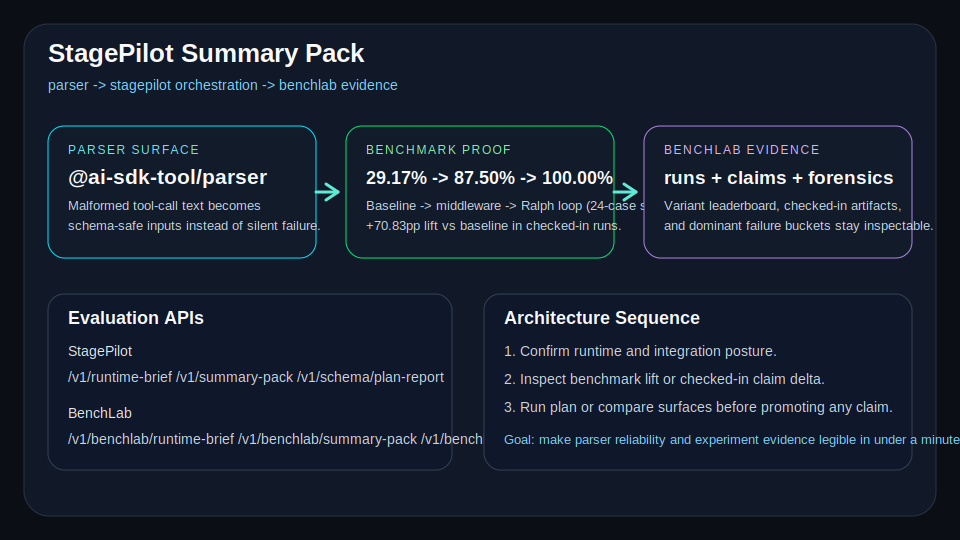

# StagePilot: Stage-Gated Tool-Calling Reliability Runtime

[](https://www.npmjs.com/package/@ai-sdk-tool/parser)
[](https://www.npmjs.com/package/@ai-sdk-tool/parser)

`StagePilot` is a TypeScript runtime and benchmark harness for stabilizing tool calls across provider families. The name comes from stage-gating unstable runs through parse, repair, replay, and review so reliability claims stay inspectable instead of hand-wavy.

The repo brings together three connected surfaces:

1. `@ai-sdk-tool/parser`: AI SDK middleware for parsing tool calls from models that do not natively support `tools`.
2. `StagePilot`: a multi-agent orchestration vertical with benchmark, API, demo UI, and Cloud Run path.
3. `BenchLab`: prompt-mode BFCL experiment tooling, forensics, and local operator APIs.

## Project links

- GitHub profile: https://github.com/KIM3310
- GitHub repository: https://github.com/KIM3310/stage-pilot
- Demo video: https://youtu.be/6trgTH1vX4M

## 60-second quick start

```bash
pnpm install
pnpm review:proof
pnpm api:stagepilot
# open http://127.0.0.1:8080/demo
```

Then read, in order:
- [`docs/validation-guide.md`](docs/validation-guide.md)
- [`docs/benchmarks/stagepilot-latest.json`](docs/benchmarks/stagepilot-latest.json)
- [`docs/executive-one-pager.md`](docs/executive-one-pager.md)
- [`docs/solution-architecture.md`](docs/solution-architecture.md)

## Quick Start

- `GET /v1/provider-benchmark-scorecard` -> `GET /v1/trace-observability-pack` -> `GET /v1/regression-gate-pack` -> `GET /v1/perf-evidence-pack` -> `GET /v1/failure-taxonomy` -> `GET /v1/summary-pack` -> `GET /v1/schema/plan-report` -> `src/`.
- Or: `GET /v1/runtime-brief` -> `GET /v1/perf-evidence-pack` -> `GET /v1/trace-observability-pack` -> `GET /v1/developer-ops-pack` -> [`docs/solution-architecture.md`](docs/solution-architecture.md).
- Or: `GET /v1/benchlab/summary-pack` -> `docs/benchlab/` -> `experiments/`.
- Bounded public live lane: `POST /v1/live-review-run` with a fixed `scenarioId`.

## Choose Your First Lane

- **Parser package (real shipping surface):** start in `src/` + `package.json`; this is the npm/runtime path that actually hardens tool-call parsing.
- **StagePilot runtime/API (real runtime surface):** start with `/v1/runtime-brief` and `/v1/summary-pack`, then trace the implementation in `src/stagepilot/` and `src/api/`.
- **BenchLab proof surface:** use `docs/benchmarks/`, `docs/benchlab/`, and `/v1/benchlab/*` for checked-in experiment evidence.
- **Static/docs-only helpers:** `docs/summary-pack.svg`, `site/`, and narrative docs are supporting docs, not the benchmark or runtime source of truth.

## Summary Pack At A Glance

- StagePilot evaluation API: `GET /v1/runtime-brief`, `GET /v1/summary-pack`, `GET /v1/schema/plan-report`
- Provider benchmark scorecard: `GET /v1/provider-benchmark-scorecard`
- Runtime perf evidence pack: `GET /v1/perf-evidence-pack`
- Trace observability pack: `GET /v1/trace-observability-pack`
- Regression gate pack: `GET /v1/regression-gate-pack`
- Failure review surface: `GET /v1/failure-taxonomy`
- StagePilot developer workflow pack: `GET /v1/developer-ops-pack`
- StagePilot workflow history: `GET /v1/workflow-runs`, `GET /v1/workflow-runs/:requestId`
- StagePilot workflow replay surface: `GET /v1/workflow-run-replay`
- Local summary: `pnpm review:proof`
- BenchLab evaluation API: `GET /v1/benchlab/runtime-brief`, `GET /v1/benchlab/summary-pack`, `GET /v1/benchlab/schema/job-report`
- Checked-in 40-case expanded benchmark proof: baseline `25.00%` -> middleware `65.00%` -> Ralph loop `90.00%` (4 documented failure cases)
- Checked-in BenchLab claims: runtime compare, variant leaderboard, best artifacts, and failure forensics
- Latest no-key local validation: `llama3.1:8b`, `llama3.2:latest`, `qwen3.5:4b` all moved from `7.83` to `8.33` with tuned RALPH variants on a `5` cases/category sweep
- Llama follow-up hunt: on `llama3.2:latest`, `schema-lock` stayed ahead while `parallel-safe`, `coverage`, `strict`, `call-count`, and `compact` all stayed flat in a `3` cases/category search; a wider `10` cases/category replay still kept `schema-lock` positive at `7.50 -> 7.75` (+0.25pp)

## Review Flow

1. `GET /v1/runtime-brief` -> confirm orchestration readiness and integration posture.
2. `GET /v1/perf-evidence-pack` -> inspect checked-in k6 rehearsal, latency posture, and release guardrails before scale claims.
3. `GET /v1/trace-observability-pack` -> inspect replayable traces and operator escalation posture before frontier-runtime claims.
4. `GET /v1/regression-gate-pack` -> inspect explicit promotion logic, watch items, and release posture.
5. `GET /v1/provider-benchmark-scorecard` -> inspect provider-family contract confidence, latency/cost posture, and strongest protocol surfaces.
6. `GET /v1/failure-taxonomy` -> inspect parser drift, retry exhaustion, delivery gaps, and observed runtime regressions in one place.
7. `GET /v1/developer-ops-pack` -> inspect MR / pipeline / release lanes before demoing automation.
8. `GET /v1/workflow-runs` -> verify recent developer workflow runs.
9. `GET /v1/workflow-run-replay` -> inspect replay-ready evidence routes and recent workflow timeline.
10. `GET /v1/summary-pack` -> inspect benchmark lift and parser/handoff boundary.
11. `GET /v1/schema/plan-report` -> verify contract before trusting downstream routing output.
12. `GET /v1/benchlab/summary-pack` -> inspect checked-in runtime and artifact claims.
13. `docs/validation-guide.md` + `docs/summary-pack.svg` + `docs/benchmarks/stagepilot-latest.json` + `docs/benchmarks/stagepilot-runtime-load-latest.json` + `docs/benchmarks/stagepilot-trace-observability-latest.json` + `docs/benchmarks/stagepilot-regression-gate-latest.json` -> read the strongest test assets first.



## Further Reading

- Validation guide: [`docs/validation-guide.md`](docs/validation-guide.md)
- Architecture: [`docs/solution-architecture.md`](docs/solution-architecture.md)
- Overview: [`docs/executive-one-pager.md`](docs/executive-one-pager.md)
- Discovery notes: [`docs/discovery-guide.md`](docs/discovery-guide.md)
- Local no-key sweep: [`docs/benchlab/LOCAL_OLLAMA_SWEEP_20260311.md`](docs/benchlab/LOCAL_OLLAMA_SWEEP_20260311.md)

## References and attribution

- Earlier fork / baseline reference: https://github.com/KIM3310/ai-sdk-tool-call-middleware
- Upstream source lineage: https://github.com/minpeter/ai-sdk-tool-call-middleware

This repo keeps attribution explicit while treating `stage-pilot` as the primary working surface for new development.

## Project context

This repo focuses on tool-calling reliability, benchmarked success-rate improvement, and operational handoff readiness.

If API integration is needed, you can connect and use it immediately through the provided API endpoints (`/v1/plan`, `/v1/benchmark`, `/v1/insights`, `/v1/whatif`, `/v1/notify`), either locally or on Cloud Run.

## Why this repo exists

Many models still output tool calls as loose text (`<tool_call>...</tool_call>`, relaxed JSON, trailing tokens, mixed formatting). This project hardens that path so tool execution remains stable instead of silently failing.

For the parser layer, this means:

- parsing malformed tool-call text safely
- coercing payloads to schema-compatible shapes
- streaming tool inputs without depending on native provider tooling

For StagePilot, this directly improves operation routing reliability by:

- applying a bounded Ralph-loop retry when the first call is invalid.

For BenchLab, it creates a repeatable environment to test prompt-mode tool-calling strategies and inspect error buckets instead of relying on anecdotal wins.

## Repository layout

```text
stage-pilot/
  src/
    api/
    bin/
    stagepilot/
  tests/
  docs/
    benchmarks/
    benchlab/
  experiments/
  scripts/
```

## StagePilot benchmark (latest)

Source: [`docs/benchmarks/stagepilot-latest.json`](docs/benchmarks/stagepilot-latest.json)
Expanded analysis: [`docs/benchmarks/expanded-benchmark-2026-03-19.md`](docs/benchmarks/expanded-benchmark-2026-03-19.md)
Generated at: `2026-03-19T03:47:44.961Z`
Cases: `40` across `20` mutation modes (`BENCHMARK_SEED=20260228`, `BENCHMARK_LOOP_ATTEMPTS=2`)

| Strategy | Parse/Plan Success | Success Rate | Avg Latency (ms) | P95 Latency (ms) | Avg Attempts |
|---|---:|---:|---:|---:|---:|
| `baseline` | 10 / 40 | 25.00% | 0.02 | 0.03 | 1.00 |
| `middleware` | 26 / 40 | 65.00% | 0.12 | 0.31 | 1.00 |
| `middleware+ralph-loop` | 36 / 40 | 90.00% | 0.05 | 0.09 | 1.35 |

Improvement deltas:

- Middleware vs Baseline: `+40.00pp`
- Ralph Loop vs Middleware: `+25.00pp`
- Ralph Loop vs Baseline: `+65.00pp`

Known failure modes (4 cases that fail even with retry):

- **wrong-tool-name** (bench-17, bench-37): model hallucinates `rout_case` instead of `route_case`; no fuzzy tool-name matching by design.
- **empty-arguments** (bench-14, bench-34): correct tool name but zero arguments; missing all required fields, retry reproduces the same empty payload.

Ralph-loop point (what changed from the original 24-case suite):

- The original 7-mode suite showed `29.17%` -> `87.50%` -> `100.00%`. The flat 100% was technically correct but masked real parser limits.
- The expanded 20-mode suite adds genuinely hard edge cases: deeply nested args, oversized payloads (>10K), unicode/emoji values, HTML-escaped JSON, double-encoded arguments, adversarial prompt injection, truncated JSON, concurrent tool calls, and wrong tool names.
- `middleware+ralph-loop` now shows `90.00%`, with 4 documented cases that fail for structural reasons, not parser bugs.

Latency note: these numbers come from deterministic in-process benchmark harness execution (parser + planning), not network LLM round-trip latency.

Review-pack surfaces now expose this benchmark delta directly through `/v1/summary-pack` so operators can inspect the lift without parsing the raw JSON file first.

## Supporting Files

- `docs/validation-guide.md`
- `docs/summary-pack.svg`
- `docs/DEVELOPER_OPS_PACK.md`
- `docs/benchmarks/stagepilot-latest.json`
- `docs/STAGEPILOT.md`
- `docs/benchlab/TOOL_CALLING_GAINS.md`
- `docs/benchlab/FAILURE_TAXONOMY.md`

## Quick start

### 1) Install

```bash
pnpm install
```

### 2) Print the validation data summary

```bash
pnpm review:proof
```

### 3) Run StagePilot demo flow

```bash
pnpm demo:stagepilot
```

### 4) Run local API + judge demo UI

```bash
pnpm api:stagepilot
# open http://127.0.0.1:8080/demo
```

### 5) Reproduce benchmark

```bash
pnpm bench:stagepilot
```

Optional benchmark knobs:

```bash
BENCHMARK_CASES=40 BENCHMARK_SEED=20260228 BENCHMARK_LOOP_ATTEMPTS=2 pnpm bench:stagepilot
```

## BenchLab quick start

Run the local BenchLab operator API:

```bash
pnpm api:benchlab
# open http://127.0.0.1:8090/benchlab
```

BenchLab surfaces:

- `GET /benchlab`
- `GET /health`
- `GET /v1/benchlab/runtime-brief`
- `GET /v1/benchlab/summary-pack`
- `GET /v1/benchlab/schema/job-report`
- `GET /v1/benchlab/configs`
- `GET /v1/benchlab/jobs`
- `GET /v1/benchlab/jobs/:id`
- `GET /v1/benchlab/jobs/:id/logs`
- `POST /v1/benchlab/jobs/:id/cancel`

BenchLab repo assets:

- research notes under `docs/benchlab/`
- runnable prompt-mode experiments under `experiments/`
- local operator scripts under `scripts/`

## StagePilot architecture (high-level)

- `EligibilityAgent`: triage eligibility and constraints
- `SafetyAgent`: risk and urgency assessment
- `PlannerAgent`: route/action plan generation
- `OutreachAgent`: execution-ready outreach actions
- `JudgeAgent`: final consistency gate
- `StagePilotEngine`: orchestration runtime
- `simulateStagePilotTwin`: what-if simulation for staffing/demand/contact-rate deltas
- `GeminiGateway` (optional): narrative summarization layer

Core files:

- `src/stagepilot/types.ts`
- `src/stagepilot/ontology.ts`
- `src/stagepilot/agents.ts`
- `src/stagepilot/orchestrator.ts`
- `src/stagepilot/twin.ts`
- `src/stagepilot/benchmark.ts`

## API surface

Run API:

```bash
pnpm api:stagepilot
```

Endpoints:

- `GET /demo`
- `GET /health`
- `GET /v1/meta`
- `GET /v1/runtime-brief`
- `GET /v1/summary-pack`
- `GET /v1/schema/plan-report`
- `POST /v1/plan`
- `POST /v1/benchmark`
- `POST /v1/insights`
- `POST /v1/whatif`
- `POST /v1/notify`
- `POST /v1/openclaw/inbox`

See full behavior and payload examples in [`docs/STAGEPILOT.md`](docs/STAGEPILOT.md).

## Runtime Surfaces

- `/v1/runtime-brief`, `/v1/summary-pack`, and `/v1/schema/plan-report` expose StagePilot readiness, benchmark proof, parser/orchestration posture, and report contract.
- `/v1/benchlab/runtime-brief`, `/v1/benchlab/summary-pack`, and `/v1/benchlab/schema/job-report` expose BenchLab evidence counts, checked-in claim proof, dominant failure buckets, and job-report expectations.
- `/demo` and `/benchlab` now render summary-pack surfaces directly in the UI so operators can validate posture without reading code first.

BenchLab API entrypoint:

```bash
pnpm api:benchlab
```

## Cloud Run deployment (Google-only)

```bash
pnpm deploy:stagepilot
```

Post-deploy smoke test:

```bash
STAGEPILOT_BASE_URL="https://<your-cloud-run-url>" pnpm smoke:stagepilot
```

Runtime notes:

- CPU-only enforced: `USE_GPU=0`
- Secret Manager key mapping expected for `GEMINI_API_KEY`
- safety timeouts supported:
  - `GEMINI_HTTP_TIMEOUT_MS`
  - `STAGEPILOT_REQUEST_BODY_TIMEOUT_MS`
  - `OPENCLAW_WEBHOOK_TIMEOUT_MS`
  - `OPENCLAW_CLI_TIMEOUT_MS`

## `@ai-sdk-tool/parser` usage

Install package only:

```bash
pnpm add @ai-sdk-tool/parser
```

Quick example:

```ts
import { createOpenAICompatible } from "@ai-sdk/openai-compatible";
import { morphXmlToolMiddleware } from "@ai-sdk-tool/parser";
import { stepCountIs, streamText, wrapLanguageModel } from "ai";
import { z } from "zod";

const model = createOpenAICompatible({
  name: "openrouter",
  apiKey: process.env.OPENROUTER_API_KEY,
  baseURL: "https://openrouter.ai/api/v1",
})("arcee-ai/trinity-large-preview:free");

const result = streamText({
  model: wrapLanguageModel({
    model,
    middleware: morphXmlToolMiddleware,
  }),
  stopWhen: stepCountIs(4),
  prompt: "What is the weather in Seoul?",
  tools: {
    get_weather: {
      description: "Get weather by city name",
      inputSchema: z.object({ city: z.string() }),
      execute: async ({ city }) => ({ city, condition: "sunny", celsius: 23 }),
    },
  },
});

for await (const part of result.fullStream) {
  // text-delta / tool-input-start / tool-input-delta / tool-input-end / tool-call / tool-result
}
```

Preconfigured middleware exports:

| Middleware | Best for |
|---|---|
| `hermesToolMiddleware` | JSON-style tool payloads |
| `morphXmlToolMiddleware` | XML-style payloads + schema-aware coercion |
| `yamlXmlToolMiddleware` | XML tool tags + YAML bodies |
| `qwen3CoderToolMiddleware` | Qwen/UI-TARS style `<tool_call>` markup |

## AI SDK compatibility

Fact-checked from this repo `CHANGELOG.md` and npm metadata (as of 2026-02-18).

| `@ai-sdk-tool/parser` major | AI SDK major | Status |
|---|---|---|
| `v1.x` | `v4.x` | Legacy |
| `v2.x` | `v5.x` | Legacy |
| `v3.x` | `v6.x` | Legacy |
| `v4.x` | `v6.x` | Active (`latest`) |

## Local development

```bash
pnpm fmt:biome
pnpm check
pnpm test
pnpm build
```

One-command verification:

```bash
pnpm verify
```

If `pnpm` is not available:

```bash
corepack enable
corepack prepare pnpm@9.14.4 --activate
```

## Docs map

- Validation guide: [`docs/validation-guide.md`](docs/validation-guide.md)
- StagePilot guide: [`docs/STAGEPILOT.md`](docs/STAGEPILOT.md)
- Latest benchmark artifact: [`docs/benchmarks/stagepilot-latest.json`](docs/benchmarks/stagepilot-latest.json)
- BenchLab gains: [`docs/benchlab/TOOL_CALLING_GAINS.md`](docs/benchlab/TOOL_CALLING_GAINS.md)
- BenchLab failure taxonomy: [`docs/benchlab/FAILURE_TAXONOMY.md`](docs/benchlab/FAILURE_TAXONOMY.md)
- Parser core examples: [`examples/parser-core/README.md`](examples/parser-core/README.md)
- RXML examples: [`examples/rxml-core/README.md`](examples/rxml-core/README.md)
- Prompt-mode experiments: `experiments/*`

## License

Apache-2.0

## Local Verification
```bash
pnpm install
pnpm verify
```

Expanded form:

```bash
pnpm check
pnpm typecheck
pnpm test
pnpm build
```

## OpenTelemetry (opt-in)

Telemetry is **opt-in** and only activates when the `OTEL_EXPORTER_OTLP_ENDPOINT` environment variable is set.

```bash
# Point at any OTLP-compatible collector (e.g. Jaeger, Grafana Tempo, Datadog)
export OTEL_EXPORTER_OTLP_ENDPOINT="http://localhost:4318"
pnpm api:stagepilot
```

When enabled the runtime will:
- Initialize an OTLP trace exporter with service name `stage-pilot`.
- Auto-instrument Node.js HTTP, DNS, and other common libraries.
- Create spans for `wrapGenerate` and `wrapStream` in the tool-call middleware.
- Record `tool_calls_total` (counter), `tool_call_parse_duration_ms` (histogram), `tool_call_retries_total` (counter), and `benchmark_success_rate` (gauge) metrics.

To initialize telemetry programmatically (e.g. in a custom entrypoint):

```ts
import { initTelemetry } from "./telemetry";
await initTelemetry();
```

| Variable | Purpose | Default |
|---|---|---|
| `OTEL_EXPORTER_OTLP_ENDPOINT` | OTLP collector base URL | _(unset = telemetry off)_ |

## Repository Hygiene
- Keep runtime artifacts out of commits (`.codex_runs/`, cache folders, temporary venvs).
- Prefer running verification commands above before opening a PR.
