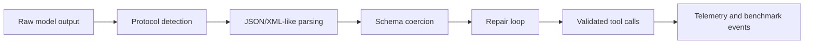

# Architecture Pack

## System Boundary

StagePilot focuses on reliability at the tool-call boundary. The core package parses, normalizes, coerces, repairs, and retries model output so applications can consume structured tool calls with fewer format-specific branches.

The repository also includes runtime, benchmark, and telemetry surfaces. Those supporting layers are useful, but the central artifact is the parser and middleware contract.

## Architecture Notes



The design keeps parser behavior testable without a live model by using mutation fixtures and deterministic protocol examples.

## Demo Path

```bash
npm ci
npm run check
npm test
npm run build
```

Useful entry points:

- `src/index.ts`
- `src/tool-call-middleware.ts`
- `src/schema-coerce/index.ts`
- `tests/hello-middleware.test.ts`
- `docs/tool-call-reliability-case-study.md`

## Validation Evidence

- Type checks, Biome checks, unit tests, and build all run through `npm run verify`.
- Benchmark documentation records the reliability claim and mutation coverage.
- Generated runtime events are kept separate from source behavior.

## Threat Model

| Risk | Control |
|---|---|
| Malformed model output | protocol detection, parser fallback, repair loop |
| Unsafe argument shape | schema coercion and validation |
| Silent reliability regression | mutation tests and benchmark summaries |
| Runtime lock-in | parser can be used independently of the wider runtime |

## Maintenance Notes

- Keep protocol-specific behavior isolated.
- Add a fixture before supporting a new model output style.
- Avoid hidden network dependencies in parser tests.
- Keep benchmark claims tied to reproducible scripts or static evidence.
