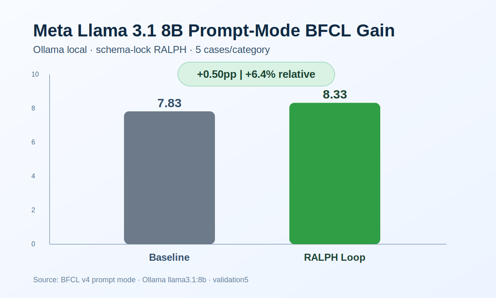
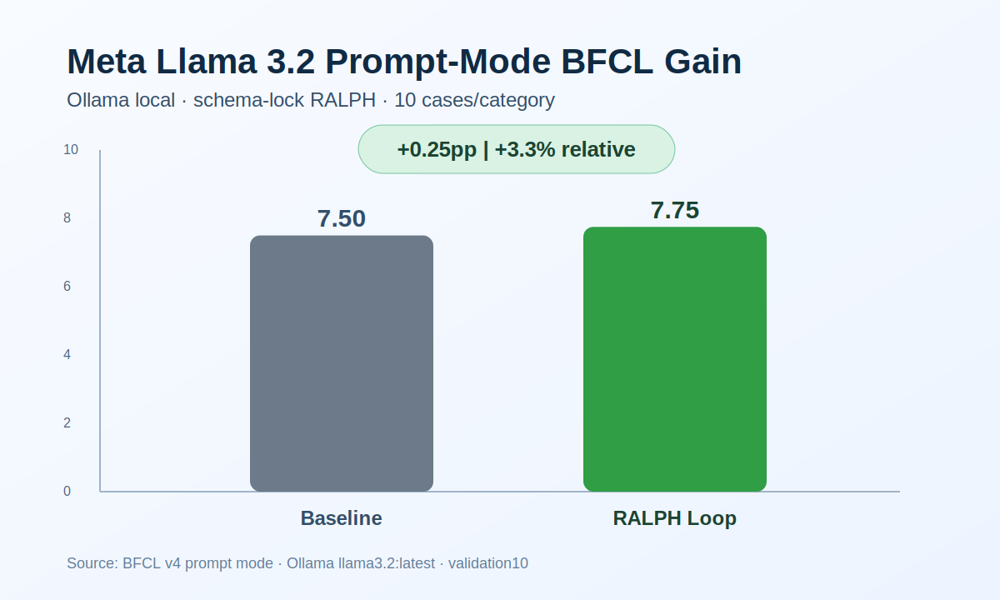
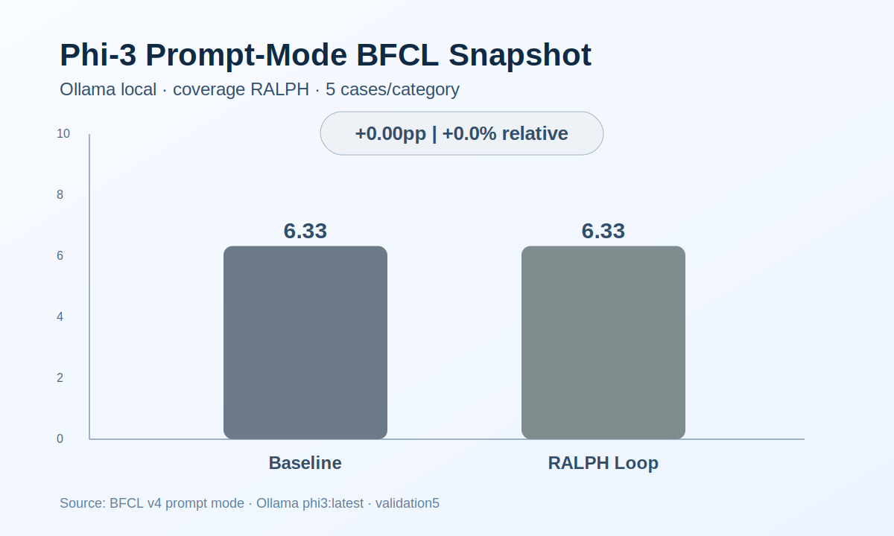

# Confirmed Tool-Calling Gains

이 문서는 **현재 이 브랜치에 실제로 체크인된 아티팩트** 기준으로 다시 확인 가능한
BFCL prompt-mode 향상 사례만 모아둡니다.

## Benchmark basis

- Benchmark: `BFCL v4` (`Berkeley Function Calling Leaderboard`)
- Mode: `prompt-mode function calling`
- Comparison: `baseline prompt` vs `RALPH loop prompt`
- Headline metric: `Overall Acc`
- Categories used in the checked-in local validation:
  - `multiple`
  - `parallel`
  - `parallel_multiple`
  - `simple_python`

## Confirmed local no-key gains (2026-03-11)

| Model | Provider | Cases / category | Variant | Baseline | RALPH | Delta (pp) | Relative delta |
|---|---|---:|---|---:|---:|---:|---:|
| `llama3.1:8b` | Ollama | 5 | `schema-lock` | 7.83 | 8.33 | +0.50 | +6.39% |
| `llama3.2:latest` | Ollama | 5 | `schema-lock` | 7.83 | 8.33 | +0.50 | +6.39% |
| `qwen3.5:4b` | Ollama | 5 | `minimal` | 7.83 | 8.33 | +0.50 | +6.39% |
| `llama3.2:latest` | Ollama | 10 | `schema-lock` | 7.50 | 7.75 | +0.25 | +3.33% |

## Flat / regressed local pilots

이 섹션은 “RALPH면 무조건 오른다”는 식의 과장을 막기 위해 남깁니다.

| Model | Provider | Cases / category | Variant | Baseline | RALPH | Delta (pp) | Outcome |
|---|---|---:|---|---:|---:|---:|---|
| `phi3:latest` | Ollama | 5 | `coverage` | 6.33 | 6.33 | +0.00 | flat |
| `gemma3:4b` | Ollama | 3 | `minimal` | 5.00 | 3.33 | -1.67 | regressed |
| `qwen2.5:1.5b` | Ollama | 3 | `minimal` | 7.50 | 6.67 | -0.83 | regressed |

## Evidence links

### Improved

- Meta Llama 3.1 8B
  - Summary: `experiments/openai-compatible-prompt-bfcl-ralph/artifacts/claim-ollama-llama3-1-8b-5-schema-lock/summary.json`
  - Report: `experiments/openai-compatible-prompt-bfcl-ralph/artifacts/claim-ollama-llama3-1-8b-5-schema-lock/benchmark_report.md`
  - CSV: `experiments/openai-compatible-prompt-bfcl-ralph/artifacts/claim-ollama-llama3-1-8b-5-schema-lock/data_overall.csv`
  - Chart: `experiments/openai-compatible-prompt-bfcl-ralph/artifacts/claim-ollama-llama3-1-8b-5-schema-lock/benchmark-ollama-llama3-1-8b-5-schema-lock.svg`
- Meta Llama 3.2 (validation5)
  - Summary: `experiments/openai-compatible-prompt-bfcl-ralph/artifacts/claim-ollama-llama3-2-5-schema-lock/summary.json`
  - Report: `experiments/openai-compatible-prompt-bfcl-ralph/artifacts/claim-ollama-llama3-2-5-schema-lock/benchmark_report.md`
  - CSV: `experiments/openai-compatible-prompt-bfcl-ralph/artifacts/claim-ollama-llama3-2-5-schema-lock/data_overall.csv`
  - Chart: `experiments/openai-compatible-prompt-bfcl-ralph/artifacts/claim-ollama-llama3-2-5-schema-lock/benchmark-ollama-llama3-2-5-schema-lock.svg`
- Meta Llama 3.2 (validation10 follow-up)
  - Summary: `experiments/openai-compatible-prompt-bfcl-ralph/artifacts/claim-ollama-llama3-2-10-schema-lock/summary.json`
  - Report: `experiments/openai-compatible-prompt-bfcl-ralph/artifacts/claim-ollama-llama3-2-10-schema-lock/benchmark_report.md`
  - CSV: `experiments/openai-compatible-prompt-bfcl-ralph/artifacts/claim-ollama-llama3-2-10-schema-lock/data_overall.csv`
  - Chart: `experiments/openai-compatible-prompt-bfcl-ralph/artifacts/claim-ollama-llama3-2-10-schema-lock/benchmark-ollama-llama3-2-10-schema-lock.svg`
- Qwen 3.5 4B
  - Summary: `experiments/openai-compatible-prompt-bfcl-ralph/artifacts/claim-ollama-qwen3-5-4b-5-minimal/summary.json`
  - Report: `experiments/openai-compatible-prompt-bfcl-ralph/artifacts/claim-ollama-qwen3-5-4b-5-minimal/benchmark_report.md`
  - CSV: `experiments/openai-compatible-prompt-bfcl-ralph/artifacts/claim-ollama-qwen3-5-4b-5-minimal/data_overall.csv`
  - Chart: `experiments/openai-compatible-prompt-bfcl-ralph/artifacts/claim-ollama-qwen3-5-4b-5-minimal/benchmark-ollama-qwen3-5-4b-5-minimal.svg`

### Flat / regressed controls

- Phi-3 flat control
  - Summary: `experiments/openai-compatible-prompt-bfcl-ralph/artifacts/claim-ollama-phi3-latest-5-coverage/summary.json`
  - Chart: `experiments/openai-compatible-prompt-bfcl-ralph/artifacts/claim-ollama-phi3-latest-5-coverage/benchmark-ollama-phi3-latest-5-coverage.svg`
- Gemma 3 4B regressed pilot
  - Summary: `experiments/openai-compatible-prompt-bfcl-ralph/artifacts/claim-ollama-gemma3-4b-3-minimal/summary.json`
  - Chart: `experiments/openai-compatible-prompt-bfcl-ralph/artifacts/claim-ollama-gemma3-4b-3-minimal/benchmark-ollama-gemma3-4b-3-minimal.svg`
- Qwen 2.5 1.5B regressed pilot
  - Summary: `experiments/openai-compatible-prompt-bfcl-ralph/artifacts/claim-ollama-qwen2-5-1-5b-3-minimal/summary.json`
  - Chart: `experiments/openai-compatible-prompt-bfcl-ralph/artifacts/claim-ollama-qwen2-5-1-5b-3-minimal/benchmark-ollama-qwen2-5-1-5b-3-minimal.svg`

## Charts

### Meta Llama 3.1 8B

### Meta Llama 3.2

Validation 5:

Validation 10 follow-up:

### Qwen 3.5 4B

### Phi-3 flat control

## Historical note

Grok 관련 historical claim은 여전히 `experiments/grok-prompt-bfcl-ralph/README.md`와 `RESULTS.md`에 남아 있습니다.
다만 현재 체크인된 no-key local artifact 세트와는 분리해서 읽는 게 맞습니다.
