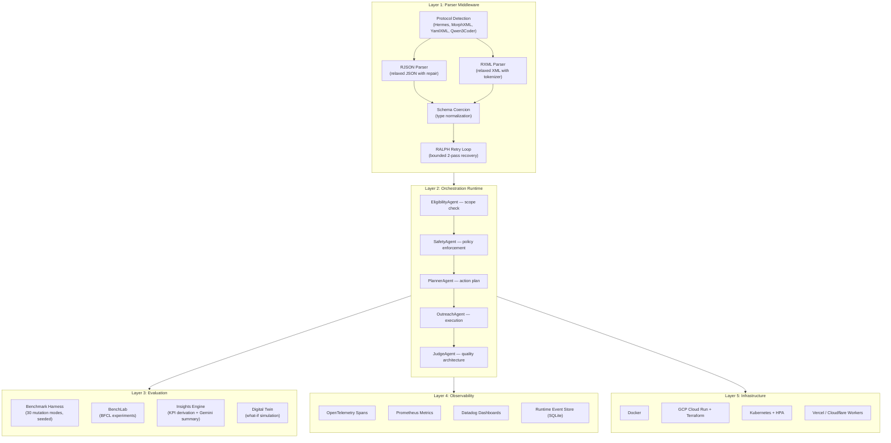
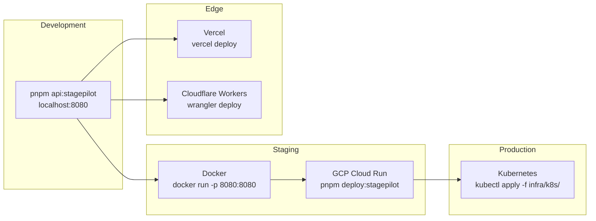

# StagePilot Solution Architecture

## Problem Statement

LLMs without native tool-calling support produce unreliable structured output. Format varies between turns (XML, JSON, YAML), tool names get hallucinated, required arguments are omitted, and types mismatch the schema. Our benchmark shows **25% baseline success rate** — meaning 3 out of 4 tool calls fail in raw form.

## Design Principles

1. **Separation of concerns** — parsing, orchestration, and observability are independent layers
2. **Fail fast, fail visible** — each stage has pass/fail gates with telemetry
3. **Incremental adoption** — use the parser alone, or the full pipeline, or just the benchmark
4. **Reproducible evaluation** — deterministic benchmarks, seeded cases, versioned artifacts

## System Layers

## Integration Boundaries

| Component | npm package | Standalone? | Dependencies |
|---|---|---|---|
| Parser Middleware | `@ai-sdk-tool/parser` | Yes | AI SDK, Zod |
| Sub-parsers | `@ai-sdk-tool/parser/rxml`, `/rjson`, `/schema-coerce` | Yes | None |
| StagePilot Runtime | — (in-repo) | Yes | Parser + Node.js |
| BenchLab | — (in-repo) | Yes | Python (for BFCL) |
| Infrastructure | — (in-repo) | Yes | Docker, K8s, Terraform |

Adopters can choose any combination:
- **Just the middleware**: `pnpm add @ai-sdk-tool/parser`, wrap your model, done
- **Middleware + benchmark**: clone the repo, run `pnpm bench:stagepilot` to validate
- **Full runtime**: deploy the API server with orchestration + observability

## Technology Selection Rationale

| Decision | Choice | Why |
|---|---|---|
| Language | TypeScript | AI SDK ecosystem is TypeScript-native. Type safety for schema coercion. |
| Parser architecture | Custom RJSON + RXML | Off-the-shelf parsers reject malformed input. We need repair, not rejection. |
| Middleware pattern | AI SDK `LanguageModelV2Middleware` | Provider-agnostic, composable, own npm lifecycle. See [ADR-002](adr/002-parser-middleware-design.md). |
| Pipeline design | Sequential 5-stage | Each stage isolates a concern. Failures are traceable. See [ADR-001](adr/001-stage-gated-pipeline.md). |
| Benchmark | Deterministic mutation | Reproducible, fast, free. See [ADR-003](adr/003-benchmark-methodology.md). |
| Observability | OTel + Prometheus | Industry standard. Vendor-agnostic. Pre-built Datadog dashboards for quick setup. |
| IaC | Terraform + K8s manifests | Cloud Run for simplicity, K8s for production scale. Both from same codebase. |

## Deployment Options

## Next Steps

- [ ] Per-model latency and cost scorecard (GPT-4o, Claude, Gemini, Qwen, Llama)
- [ ] Hosted benchmark dashboard with historical trend tracking
- [ ] Signed artifact snapshots for benchmark runs (tamper-proof)
- [ ] Multi-tool schema benchmark expansion
- [ ] Community middleware protocol contributions
